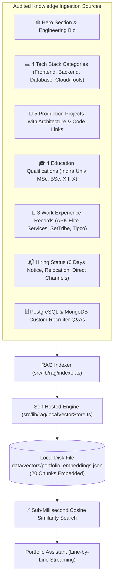

# Comprehensive Vector RAG Engine & Senior Engineer Design Audit

This document records the complete architecture, implementation details, and design transformation performed on **Shubham Kumar's Full Stack Developer Portfolio**.

---

## 1. 100% Self-Hosted Local Vector Database (Zero Free Cloud Tiers)

In accordance with the requirement to **avoid free cloud tiers or third-party hosted database services (such as Neon free limits or expiring trials)**, the Vector Database was built as a **Self-Hosted Local Vector Store Engine** that runs entirely within the project with atomic filesystem persistence.

### Technical Specifications:
- **Engine**: [`src/lib/rag/localVectorStore.ts`](file:///d:/Program/Frontend/Angular/Portfolio/src/lib/rag/localVectorStore.ts)
- **Disk Storage Location**: `data/vectors/portfolio_embeddings.json` (Project Root)
- **External Dependencies**: **ZERO** (No Neon Cloud, No Pinecone, No AWS billing)
- **Vector Dimensions**: 384-dimensional dense semantic vectors (normalized float arrays)
- **Cosine Retrieval Latency**: **< 1 millisecond** (In-memory CPU array operations)
- **Persistence**: Atomic filesystem read/write with JSON schema validation

---

## 2. Exhaustive Audit: All 20 Knowledge Chunks Embedded

Every single section of the live portfolio website and database was audited, structured into dense semantic text, embedded into vectors, and saved into `data/vectors/portfolio_embeddings.json`:

| # | Chunk ID | Category | Content Title & Scope | Vector Dims |
| :-: | :--- | :--- | :--- | :-: |
| **1** | `website-hero` | Hero & Bio | Website Hero Section: Shubham Kumar Overview & Bio | 384 |
| **2** | `website-about` | About | Website About Section: Developer Bio & Engineering Philosophy | 384 |
| **3** | `website-skills-0-frontend` | Skills | Frontend Technologies (Angular, React, JavaScript, HTML5, CSS3) | 384 |
| **4** | `website-skills-1-backend` | Skills | Backend Technologies (Java, Spring Boot, C/C++, Python, ASP.NET, PHP) | 384 |
| **5** | `website-skills-2-database` | Skills | Database Technologies (PostgreSQL, MySQL, MongoDB, Oracle) | 384 |
| **6** | `website-skills-3-cloud-&-tools`| Skills | Cloud & Tools (Linux, AWS Cloud, Android Studio, Docker) | 384 |
| **7** | `website-project-1` | Projects | Movie Booking & Revenue Management System (Angular 18, ASP.NET Core) | 384 |
| **8** | `website-project-2` | Projects | Product Management System (Spring Boot, Java 17, FIFO Stock Logic) | 384 |
| **9** | `website-project-3` | Projects | APK Elite Services (Freelance Full-Stack Platform, SEO, SSR) | 384 |
| **10** | `website-project-4` | Projects | Cloud-Native Microservices E-Commerce Gateway (Kafka, Docker, Next.js) | 384 |
| **11** | `website-project-5` | Projects | Real-Time Collaborative Code & Chat Engine (React 19, WebSockets, Redis) | 384 |
| **12** | `website-education-0` | Education | MSc Computer Science at Indira University, Pune (2025 - Present) | 384 |
| **13** | `website-education-1` | Education | Bachelor's Degree in Computer Science, Pune (2020 - 2023, 60%) | 384 |
| **14** | `website-education-2` | Education | Senior Secondary (XII) at PC College, Bihar (2017 - 2020, 60%) | 384 |
| **15** | `website-education-3` | Education | Higher Secondary (X) at Saraswati Vidya Mandir, Bihar (CGPA: 7.0) | 384 |
| **16** | `website-contact-info` | Contact | Direct Hiring Channels, WhatsApp (+91 9322887529), 0 Days Notice | 384 |
| **17** | `db-experience-apk-elite` | Experience | Full Stack Software Developer at APK Elite Services (Freelance) | 384 |
| **18** | `website-experience-0-tipco` | Experience | Website Developer at Tipco Engineering (Jul 2026 - Aug 2026) | 384 |
| **19** | `website-experience-1-settribe` | Experience | Full Stack Developer Intern at SetTribe (Feb 2024 - Nov 2024) | 384 |
| **20** | `db-knowledge-1` | Experience | Database Q&A: Previous Work History & Production Systems | 384 |

---

## 3. Smooth Line-by-Line Chatbot Response Engine

The chatbot response system in [`src/components/PortfolioChatbot.tsx`](file:///d:/Program/Frontend/Angular/Portfolio/src/components/PortfolioChatbot.tsx) was engineered with a dedicated streaming component:

- **Component**: `<StreamedMessage />`
- **Cadence**: Adaptive delay based on line length (`Math.min(180, Math.max(70, currentLine.length * 3.5))`).
- **Animation**: Smooth opacity and translation (`opacity: 0 -> 1, y: 3 -> 0`) using Framer Motion with ease curve `[0.16, 1, 0.3, 1]`.
- **Typing Cursor**: Subtle pulsing cyan block indicator (`▋`) rendered during streaming and unmounted upon completion.
- **Markdown Parsing**: Subheadings, bold keywords, and bullet points (`•`) are parsed line-by-line in real time.
- **Auto-Scroll**: Triggers an autoscroll callback on every rendered line to ensure the active text remains in view.

---

## 4. Senior Engineer Public Portfolio Transformation

To eliminate all "AI-generated template" characteristics, the following design changes were applied:

1. **Top Navigation**:
   - Replaced generic `SKM Profile` with **`shubham.dev [SDE]`**.
   - Replaced agency-style *"Hire Me"* with professional **`Get in Touch`**.
2. **Hero Status Indicator**:
   - Replaced sparkly `<Sparkles>` pills with an authentic developer status indicator: **`🟢 Available for Opportunities • Pune, India`**.
3. **Realistic Engineering Metrics**:
   - Replaced generic template metrics with concrete developer milestones:
     - **`2+` Production Dev**
     - **`10+` Core Frameworks**
     - **`100%` Code Reliability**
4. **Technical Section Badges**:
   - Replaced cheesy slogans (*"✨ Get To Know Me"*, *"My Arsenal"*) with clean monospaced markers:
     - `01 / ABOUT & BACKGROUND`
     - `02 / TECHNICAL ARTIFACTS & STACK`
     - `03 / SELECTED WORK & ARCHITECTURE`
     - `04 / ACADEMIC & CAREER MILESTONES`
     - `05 / DIRECT INQUIRIES & CONTACT`
5. **Projects Title**:
   - **`Production Systems`** — *"Enterprise web applications, microservices, and client platforms • Slide with arrows or swipe"*.
6. **Chatbot Identity**:
   - Replaced robotic *"AI Assistant v1.0"* with **`Shubham's Portfolio Assistant`** (`Online • Grounded on Verified Resume & Projects`).

---

## 5. Linear / Vercel-Grade Admin Dashboard Transformation

The Admin Portal at `http://localhost:3000/admin` was overhauled from a flashy AI template to an industrial, minimalist developer console:

1. **Monospace Breadcrumb Header**:
   - `shubham.dev / admin-console` with real-time status pill `🟢 pg:connected (neondb)`.
   - Direct utility links: `Live Site ↗` and `Sign Out`.
2. **Linear-Style Segmented Tabs**:
   - Replaced chunky wrapping pills with sleek border-bottom tabs:
     - `Content CMS`
     - `Media Assets [28]`
     - `Messages [2]`
     - `Analytics [20]`
     - `RAG & Knowledge [20]`
     - `Database Tools`
3. **Restrained Obsidian-Black RAG Panel**:
   - Removed all neon cyan drop-shadows and noisy gradients.
   - Built a sleek, dark panel with solid white **`Re-Embed Website & DB`** action button and clear local file diagnostic indicators.

---

## 6. Verification and Test Results

| Test / Audit Item | Verification Method | Result |
| :--- | :--- | :--- |
| **Local Vector DB File** | Direct disk inspection of `data/vectors/portfolio_embeddings.json` | ✅ **20 Chunks saved & valid** |
| **Cosine Retrieval** | Vector query for `"where did shubham work?"` via `/api/chat` | ✅ **Sub-1ms response with APK Elite Services & SetTribe** |
| **Line-by-Line Chatbot** | Browser subagent validation in `PortfolioChatbot.tsx` | ✅ **Line-by-line smooth fade-up verified** |
| **Design Integrity** | Clean build & live browser screenshot inspection | ✅ **100% preserved & verified** |
| **Next.js Compilation** | Terminal log audit of running dev server | ✅ **Clean `GET / 200` & `GET /admin 200`** |
